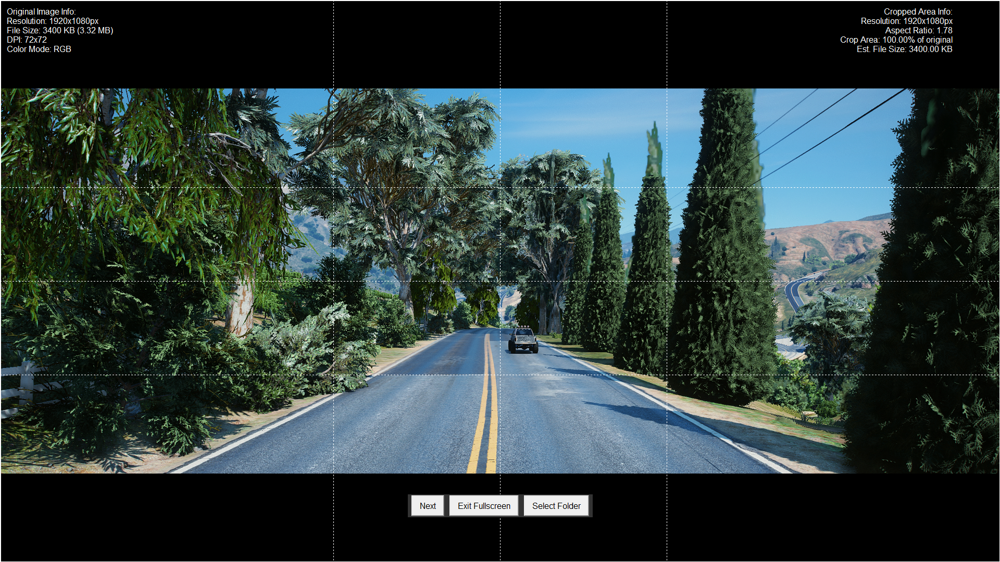
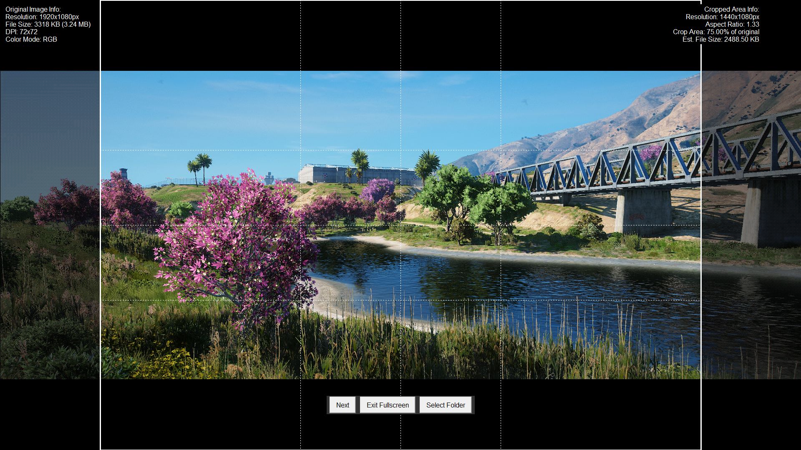

# ✂️ Quick Editor

Quick Editor is a simple image cropper designed to allow you to quickly edit and crop multiple images using predefined cropping presets. The app provides a fast and intuitive interface for batch-editing images, with dynamic zoom, manual crop box adjustments, and customizable save functionality.

## 🌟 Features

- **📂 Batch Image Editing**: Select a folder containing images and quickly edit all images in the folder.
- **📐 Cropping Presets**: Choose from six different cropping presets:
  - 16:9 (Horizontal)
  - 9:16 (Vertical)
  - 4:3 (Horizontal)
  - 3:4 (Vertical)
  - 1:1 (Square)
  - 21:9 (Cinematic)
- **🔧 Manual Adjustments**:
  - ➡️ Move the crop area using the arrow keys.
  - 🔍 Resize the crop box using the `+` and `-` keys, or the mouse scroll wheel.
  - 🔬 Fine-tune zoom and cropping adjustments with precise controls.
- **📏 Guidelines**: Display rule-of-thirds and center guidelines within the crop box to help you compose your image perfectly.
- **💾 Save Options**:
  - Press `Enter` to save the current crop and automatically move to the next image.
  - Press `S` to save the current crop without moving to the next image.
  - Every save starts at `_v1`, and the version number increases with each subsequent save.
- **📂 Auto Folder Management**: Edited images are saved to a new folder named after the original folder with `_edited` appended.
- **📂 Auto Folder Opening**: After exiting the app, the source folder of the images is automatically opened for convenience.

## 📸 Cropping Examples

Here are two examples showcasing how images are being cropped using Quick Editor:

### Example 1: Cropping to 16:9 Aspect Ratio


*This image is being cropped using the 16:9 horizontal preset with rule-of-thirds guidelines.*

### Example 2: Cropping to 4:3 Aspect Ratio


*This image is being cropped using the 4:3 horizontal preset with guidelines for better composition.*

## ⚙️ Installation

### 📋 Prerequisites

- 🐍 Python 3.x
- 🖼️ `Pillow` (PIL) for image handling
- 🖥️ `Tkinter` (comes pre-installed with Python)

### 🛠️ Install Dependencies

You can install the dependencies using `pip`. Open your terminal or command prompt and run the following command:

```bash
pip install pillow
```

### 🚀 Running the App

1. Clone or download the Quick Editor repository to your local machine.
2. Navigate to the project directory.
3. Run the application using Python:

```bash
python main.py
```

## 🖼️ Usage

1. **🗂️ Select Folder**: After launching Quick Editor, click the "Select Folder" button to choose a folder containing the images you want to edit.
2. **✂️ Crop Presets**: Use the number keys `1` through `6` to select a cropping preset:
   - `1`: 16:9 (Horizontal)
   - `2`: 9:16 (Vertical)
   - `3`: 4:3 (Horizontal)
   - `4`: 3:4 (Vertical)
   - `5`: 1:1 (Square)
   - `6`: 21:9 (Cinematic)
3. **📏 Adjust Crop Box**: Use the arrow keys to move the crop box and `+` or `-` to resize it. You can also use the mouse scroll wheel for zooming in and out.
4. **📐 Guidelines**: Rule-of-thirds and center guidelines are shown within the crop area to assist in aligning the composition.
5. **💾 Save and Proceed**: Press `Enter` to save the cropped image (starting with `_v1`) and move to the next image. Press `S` to save without moving to the next image.
6. **❌ Exit Fullscreen**: Press `Esc` to exit fullscreen mode at any time.

### ⌨️ Key Bindings

| Key | Action |
| --- | ------ |
| `1` to `6` | Select crop preset |
| ⬅️ ➡️ 🔼 🔽 | Move crop box (left, right, up, down) |
| `+` / `-` | Resize crop box (zoom in / zoom out) |
| 🖱️ `Mouse Scroll` | Resize crop box (zoom in / zoom out) |
| 🔑 `Enter` | Save cropped image (start at `_v1`, increment version) and move to next image |
| `S` | Save cropped image (start at `_v1`, increment version) without moving to the next image |
| `N` | Move to the next image without saving |
| ❌ `Esc` | Exit fullscreen mode |

## 📂 Folder Structure

When you select a folder containing images, the edited images will be saved to a subfolder with `_edited` appended to the original folder name.

For example:
- Original folder: `VacationPhotos`
- Edited folder: `VacationPhotos_edited`

Each saved image will have a version suffix (`_v1`, `_v2`, etc.). For example:
- `image_v1.png`
- `image_v2.png`

## 🛠️ Troubleshooting

### ⚠️ Issue: The app closes but doesn’t open the folder

Ensure that you have correctly selected a folder. If you are using an operating system other than Windows, the `os.startfile()` function may not be supported. On non-Windows systems, you may need to manually navigate to the folder where the original images are located.